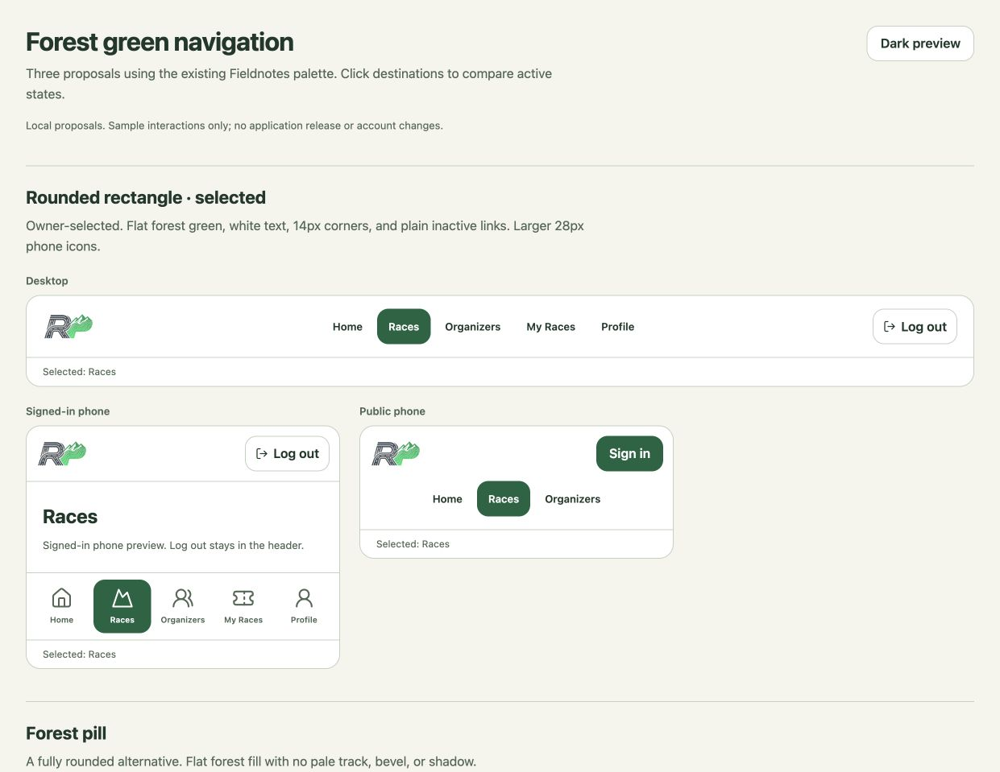
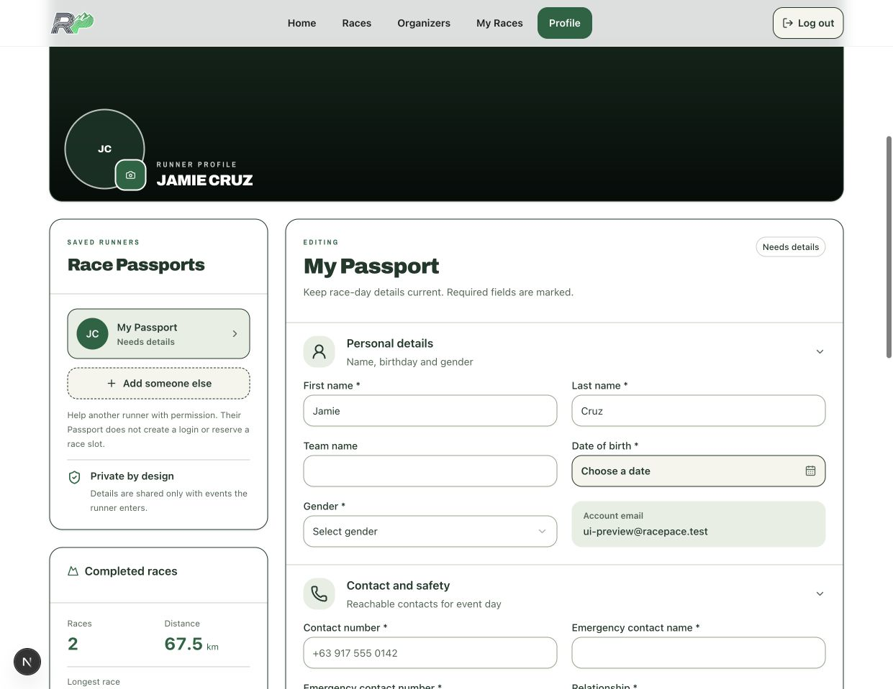
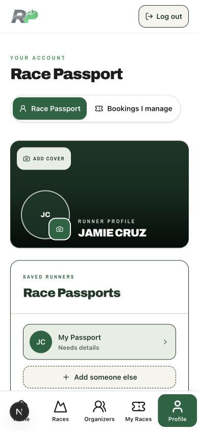
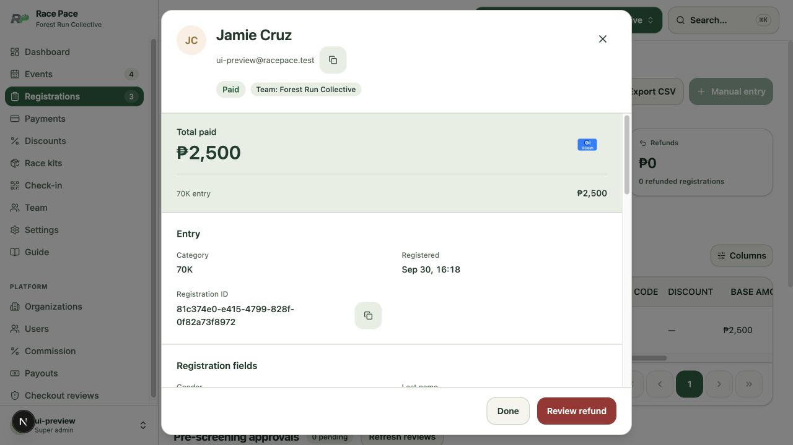
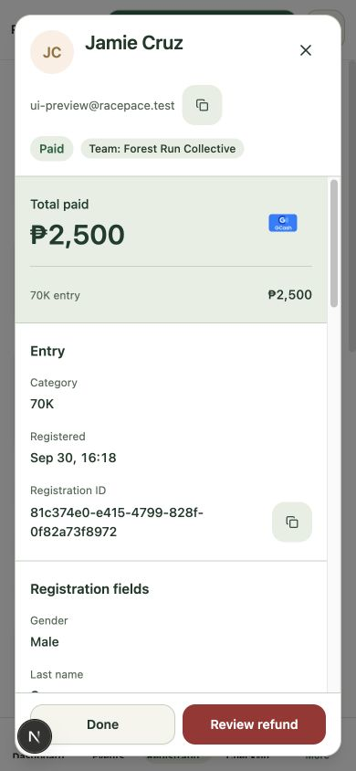
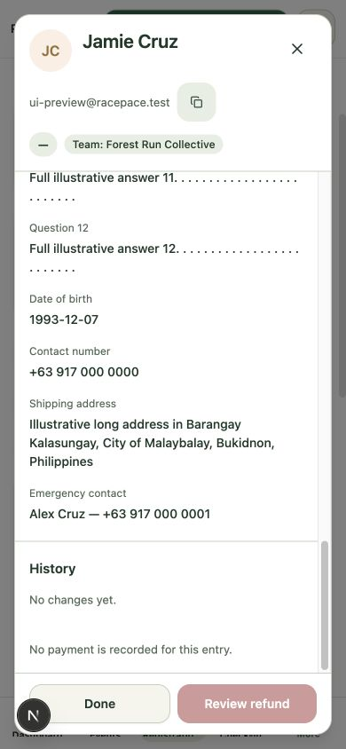

# Browser UI refinements — local implementation

Date: 2026-09-30. Branch: `codex/browser-ui-refinements`.
Base: `origin/staging` at `f7ded2161e87a9e662ff7b65d30e770688b5e5a5`.
Worktree: `/Users/jsonse/.codex/worktrees/browser-ui-refinements/race-pace`.

All 15 browser annotations and the registration dialog follow-up are implemented locally. The owner selected the flat forest rounded rectangle after reviewing the corrected navigation alternatives. The active fill is `#176341`, with white text, 14px corners, no pale track, no bevel, and no shadow. Phone navigation retains all five labels and uses 28px icons with 64px targets.

## Implemented behavior

| Comments | Result |
| --- | --- |
| 1–4 | Active admin links match the organization switch. Reservations show the actual booker name/avatar, separate managed participants, and actual Philippine-time payment date. Commission cards have consistent vertical spacing. |
| 5–9 | Coming Soon badge has no dot. Available reservation actions are forest buttons. Mobile Log out uses the existing auth action. Header and bottom navigation switch at 768px. Public navigation wraps below 480px. |
| 10–11 | Home cards have primary borders and equal-height grid wrappers. Organizer rows show organization avatars with initials fallback. Long names wrap within the phone layout. |
| 12–15 | Own paid entries in completed events supply races, distance and longest category distance. Cards appear below Race Passports, followed by registered events and pre-screening updates. Errors, loading, expired holds and mixed-group rejections have explicit states. |
| Dialog follow-up | Every noninteractive registration data cell opens a centered inspector. Header and actions remain visible; grouped submitted values scroll and wrap. Checkboxes and sorting retain their behavior. |

There is no individual finisher result or geographic achievement record in the existing schema. The profile explains its completed-event basis. It does not claim a verified finish, altitude or location achievement. Rejected participants remain visible after the rest of their group pays. The cards link to existing payment/request pages.

Profile screening reads use `getUser()`, the booking owner's explicit filter, a 20-batch limit, and presentation-only fields. Admin identity reads retain event/organization filters and existing row-level security. Payment figures remain display-only. No migration, backend source, provider configuration or payment authorization change is included.

## Validation

| Check | Result |
| --- | --- |
| Runner suite | 74 files, 537 tests passed |
| Admin suite, final rerun | 126 files, 1,030 tests passed |
| Backend/functions/shared contracts | 103 files, 854 tests passed |
| Shared UI suite | 2 files, 13 tests passed |
| Focused final navigation/profile rerun | 3 files, 14 tests passed; included in the runner total |
| Type checks | Runner, admin and shared UI passed |
| Isolated production builds | Runner and admin passed after stopping their dev servers |
| Fieldnotes audit | 321 current modules, 256 audited, zero remaining native sites or duplicate primitives |
| Migration replay | 178/178; no retired push job or legacy service-role vault key |
| Storybook Hub | Typecheck and all four catalog builds passed; served Docker rebuild completed |
| Whitespace | `git diff --check` passed |

Unique test total: **2,434 passed**. The dialog follow-up adds five meaningful tests; its focused run passed all 52 cases across the table, registrations table and inspector. The root backend run initially omitted the exported local database environment. Correcting the test setup restored the complete passing run without backend changes. Existing jsdom navigation and Node local-storage warnings do not fail the suites. Root lint is a no-op and is not claimed as validation.

The isolated Supabase instance initially used ports 595xx and disposable local fixtures. The migration assertion repeats the CI script's count/job/key checks with its local safety port adjusted to 59522. During the follow-up, another task owned 595xx, so this task's instance moved to 605xx and restored its saved fixtures. A fake local payment supported read-only refund-review acceptance. The shared development stack, other isolated projects and hosted projects were not used for fixture writes.

## Browser evidence

Browser inspection covered application phone widths 320 and 390, tablet width 768, and desktop width 1241. The final local phone Log out click returned to `/`, exposed Sign in, and removed signed-in navigation. At 768px the header navigation is visible and bottom navigation is hidden. At 320px all five labels fit and icons measure 28px.

Actual admin readback showed the active sidebar and organization switch at `rgb(23, 99, 65)`. The local reservation row showed Jamie Cruz with initials avatar and `Sep 30, 2026, 9:15 AM PHT`. The date persists after conversion to an entry. Both fee sections have 12px top spacing, and the reservation table contains its own horizontal scrolling.

Home cards in the same row had identical top, bottom and height despite different title lengths. Their borders read back as the primary forest color. Available category actions were forest with white text and 44px height. Coming Soon had zero dot children. Organizer rows loaded `logo_url` instead of event photography. The phone directory has no page overflow after long-name wrapping. The category anchor clears the 117px public header with 128px scroll margin.

The real local profile showed 2 completed entries, 67.5 km, and 42.5 km longest category. Its upcoming 70K entry appeared only in Registered events. The rejected request retained its explanation and released-slot notice. The Storybook composition also demonstrated error and payable states without navigation or payment side effects. Keyboard Tab showed a visible focus outline. Dark preview kept a flat forest active fill and white text.

## Review surfaces and delivery

- [Navigation comparison](https://storybook.lan/race-pace/iframe.html?id=fieldnotes-proposals-browser-refinements-navigation-options--compare&viewMode=story)
- [Profile activity composition](https://storybook.lan/race-pace/iframe.html?id=fieldnotes-proposals-browser-refinements-profile-activity--populated&viewMode=story)
- [Registration inspector](https://storybook.lan/race-pace/iframe.html?id=fieldnotes-proposals-browser-refinements-registration-details--paid&viewMode=story)
- [Long registration details](https://storybook.lan/race-pace/iframe.html?id=fieldnotes-proposals-browser-refinements-registration-details--long-content&viewMode=story)
- [Acceptance contract](../../docs/specs/2026-09-30-browser-ui-refinements.md)
- [PIV review](../code-reviews/2026-09-30-browser-ui-refinements.md)

Hub-owned changes are limited to the 16 new files under `projects/race-pace/src/proposals/browser-refinements/`. Existing Hub changes were preserved. The original dirty Race Pace checkout was preserved.

## Centered registration inspector

The installed official shadcn Dialog remains the primitive. Its centered transform now has no conflicting top override. A component-specific rule sets a 760px maximum width and 16px viewport gutters, with a dynamic viewport height limit. A fixed identity header includes the avatar, full name, full email, status and team. Payment, entry, submitted answers and real history occupy the internal scroll region. Labels sit above values. Desktop uses two columns; phones use one. Done and refund review remain in the fixed footer.

The existing URL-driven `?reg=` callback now belongs to the row. A native button remains in the first visible data cell for keyboard access. Data cells open the inspector; checkbox, sorting, other interactive controls, modifiers and text selection retain their own behavior. Existing financial calculations and guarded action dialogs are reused.

Actual application geometry passed at 1280×720, 768×640, 390×844 and 320×568. The desktop inspector measured 760×688 at x260/y16. The tablet measured 736×608 at x16/y16. The 390px phone measured 358×812 at x16/y16. All have matching top/bottom gutters and no horizontal dialog overflow. Long fixture names, emails and 12 extended answers also fit the smallest phone, with the final explanation reachable by scrolling.

Category and amount cells opened the actual app dialog. Checkbox selection did not open it. Enter opened the native runner action; Escape closed the dialog and restored focus to that action. Keep it closed the real refund review and returned focus to Review refund. No refund was submitted. Deep-link opening after reload also passed.

The admin suite, admin typecheck, shared UI suite/typecheck, source audit and admin production build passed again for this follow-up. Hub typecheck and all four builds passed, followed by the final Race Pace catalog build and served Docker rebuild. Served preview readback confirmed the finished inspector. No application or catalog tests claim a live provider refund.

The Hub component differs from the application only in import adapters and its preview stylesheet. Snapshot SHA-256 is `569643e7687308b69481b34d9e8b480352eb739717797bb36a33dcb1f5e66861`. Application and Hub inspector CSS match at `dcbfd387aed802762197b0fbe8fe124125298aab7642ff5756bf4eff56db36c1`. Fixtures contain illustrative identities and contacts only.

Local implementation and review are complete. Task-owned app servers, authentication helper, function server and isolated Supabase stack are stopped. The shared development stack remains untouched; the selected Storybook preview remains open. No commit, push, pull request, deployment, hosted write, or real charge was performed. Publishing requires the repository's staging-first release workflow and fresh hosted acceptance.
